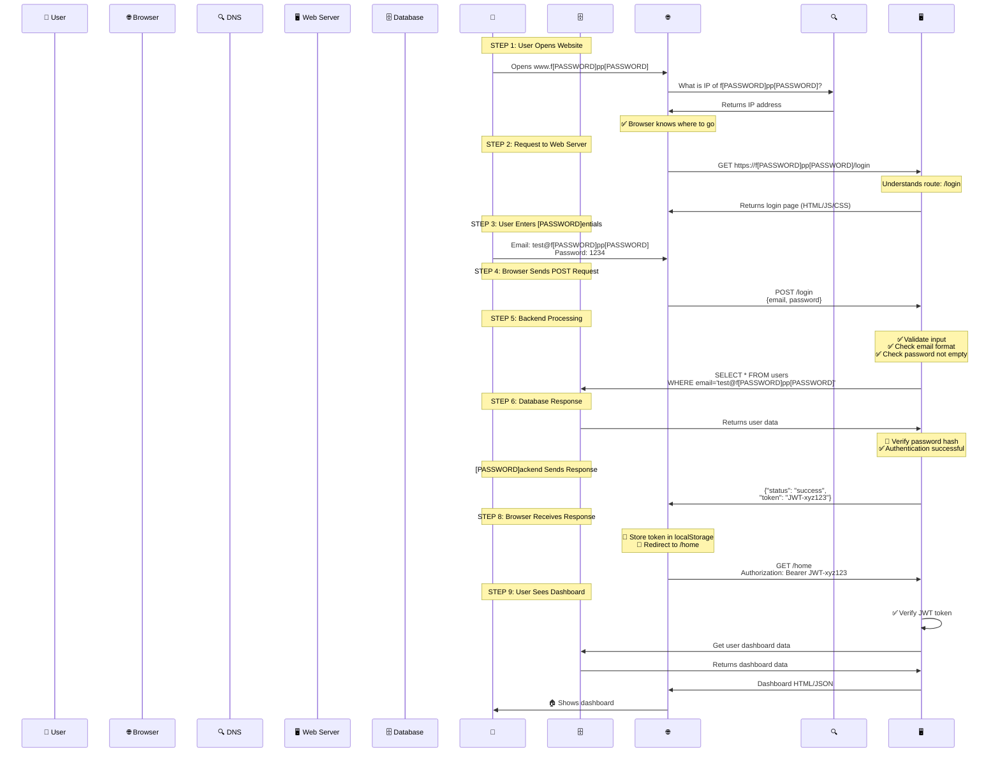

# 🌐 Simple Web Application

## 🏗️ Architecture:

```
👤 User → 🔍 DNS → 🖥️ Web Server (Backend) → 🗄️ Database → 📤 Backend Response → 🌐 Browser → 🎨 UI Update
```

---

## 📖 Explanation:

The **user** sends a request from the **browser**, which resolves through **DNS** and reaches the **backend server**. 

The **backend** processes the request, interacts with the **database** for data retrieval, and then returns an **HTTP response** containing:

- ✅ Status code
- 📋 Headers
- 📊 Data

The **browser** then processes this response, stores **authentication tokens** if present, and updates the **UI** accordingly or redirects the user.

---

## 📝 Example: Let's See What Happens When We Access www.f[PASSWORD]pp[PASSWORD]

### 📍 Step 1: User Opens a Website

#### What happens?

**1️⃣ DNS Lookup**

**Browser asks:** "What is the IP of f[PASSWORD]pp[PASSWORD]?"

🔍 **DNS returns the IP.**

✅ Now Browser knows where to go.

---

### 🚀 Step 2: Request Goes to the Web Server

**Browser sends a request:**

```http
GET https://f[PASSWORD]pp[PASSWORD]/login
```

The request goes to the **Web Server** (Backend Application)
- 🐍 Python
- ☕ Java  
- 💚 Node.js

#### 🤔 What happens in Web Server?

Web Server receives request and:

**1️⃣ Understands Route**
- `/login` page requested

**2️⃣ Sends HTML Page back or API response**

| Type | Response |
|------|----------|
| 🌐 **Simple website** | Sends the login page (HTML/JS/CSS) |
| ⚡ **Modern app** | Sends API response only |

---

### 🔐 Step 3: User Enters Login Details

```plaintext
Email: test@f[PASSWORD]pp[PASSWORD]
Password: 1234
```

---

### 📤 Step 4: Browser Sends the POST Request

```http
POST /login
Content-Type: application/json

{
  "email": "test@f[PASSWORD]pp[PASSWORD]",
  "password": "1234"
}
```

---

### ⚙️ Step 5: Backend Processing (Important Part)

Now backend does the **actual work**:

#### 1️⃣ Validate Input

**Checks performed:**
- ✅ Is the email format correct?
- ✅ Is password empty?

```javascript
// Example validation
if (!email.includes('@')) {
  return error('Invalid email format');
}
if (password.length === 0) {
  return error('Password cannot be empty');
}
```

---

#### 2️⃣ Query Database

**Backend sends SQL Query:**

```sql
SELECT * FROM users
WHERE email = 'test@f[PASSWORD]pp[PASSWORD]';
```

**What happens next?**

| Step | Action | Result |
|------|--------|--------|
| 🔍 | Database searches for user | Finds matching record |
| 🔐 | Compare password hash | Validates credentials |
| ✅ | Authentication successful | Generate session token |

---

#### 3️⃣ Password Verification

```python
# Backend compares hashed passwords
stored_hash = user.password_hash
input_hash = hash(user_input_password)

if stored_hash == input_hash:
    # ✅ [PASSWORD]essful
    create_session_token()
else:
    # ❌ Login failed
    return error('Invalid credentials')
```

---

### 🗄️ Step 6: Database Role (Simple View)

Database only does **ONE thing**:

#### 👉 Store and retrieve data

---

**❌ It does NOT:**

| What Database DOESN'T Do | Who Handles It |
|---------------------------|----------------|
| 🚫 Handle login logic | Backend/Web Server |
| 🚫 Handle UI | Frontend/Browser |
| 🚫 Process business rules | Backend Application |

---

**✅ What Database DOES:**

```sql
-- Database just responds to queries
SELECT * FROM users WHERE email = 'test@f[PASSWORD]pp[PASSWORD]';
-- Returns: user data
```

> **Think of database as a librarian** 📚
> 
> You ask for a book → Librarian finds it → Gives it to you
> 
> Database doesn't read the book or decide what to do with it!

---

### 📤 Step 7: Backend Sends Response

**If login is successful:**

```json
{
  "status": "success",
  "message": "[PASSWORD]essful",
  "token": "JWT-xyz123"
}
```

#### 🔐 What's in the token?

> **JWT (JSON Web Token)** contains:
> - User ID
> - Expiration time
> - Encrypted signature

---

### 🟢 Step 8: Browser Receives Response

**Now browser:**

#### 1️⃣ 💾 Stores token (cookie/local storage)

```javascript
// Example: Store in localStorage
localStorage.setItem('authToken', 'JWT-xyz123');
```

#### 2️⃣ 🔄 Redirects user to homepage

```javascript
window.location.href = '/home';
```

---

### 🏠 Step 9: User Sees Dashboard

**Now browser calls:**

```http
GET /home
Authorization: Bearer JWT-xyz123
```

#### ⚙️ Backend again:

| Step | Action | Result |
|------|--------|--------|
| 1️⃣ | **Checks token** | Validates JWT signature |
| 2️⃣ | **Returns user data** | Fetches personalized info |
| 3️⃣ | **Shows dashboard** | Renders homepage |

```python
# Backend validates token
def get_home(request):
    token = request.headers['Authorization']
    
    # ✅ Verify token
    user = verify_jwt(token)
    
    if user:
        # 📊 Fetch user-specific data
        dashboard_data = get_user_dashboard(user.id)
        return dashboard_data
    else:
        # ❌ Invalid token
        return error('Unauthorized')
```

---

## 🔄 Complete Flow Diagram:



---


## 💡 Key Takeaways:

✅ DNS translates domain names to IP addresses

✅ Web servers process routes and return responses

✅ Database only stores and retrieves data (no business logic)

✅ Modern apps use API responses instead of full HTML pages

✅ JWT tokens enable secure, stateless authentication

✅ Browser manages token storage and UI updates

---

